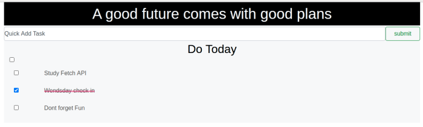

# Development Strategy

> `Restful app`

A basic web page aim to learn Fetch API and Methods of REST API.

## Wireframe

## 0. Set-Up

_A User can see my initial repository and live demo_

### Repository

- Created a new repository from this [template](https://github.com/HackYourFutureBelgium/restful-pjs)
- Clone the repository
- Write initial, basic README
- Add a wireframe
- Start the development strategy
- Prepare a project board
- Push the changes to GitHub
- Turn on GitHub Pages

## 1. Basic Style

**As a site visitor, I want to see styled website for my todo list.**

This user story has been developed through a branch called 'style'.

> Assign to **Mamé Azad**

### HTML

Add bootstrap classes

### CSS

Styled todo list

### javascript

No changes
